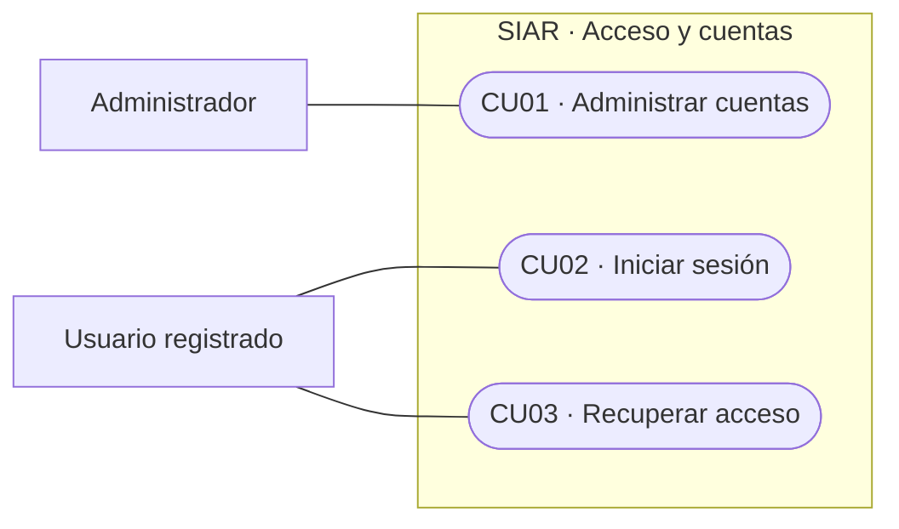
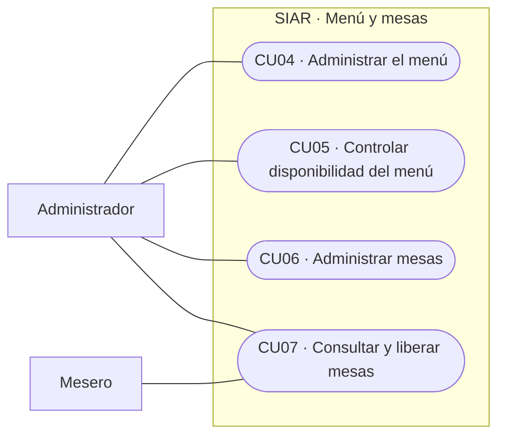
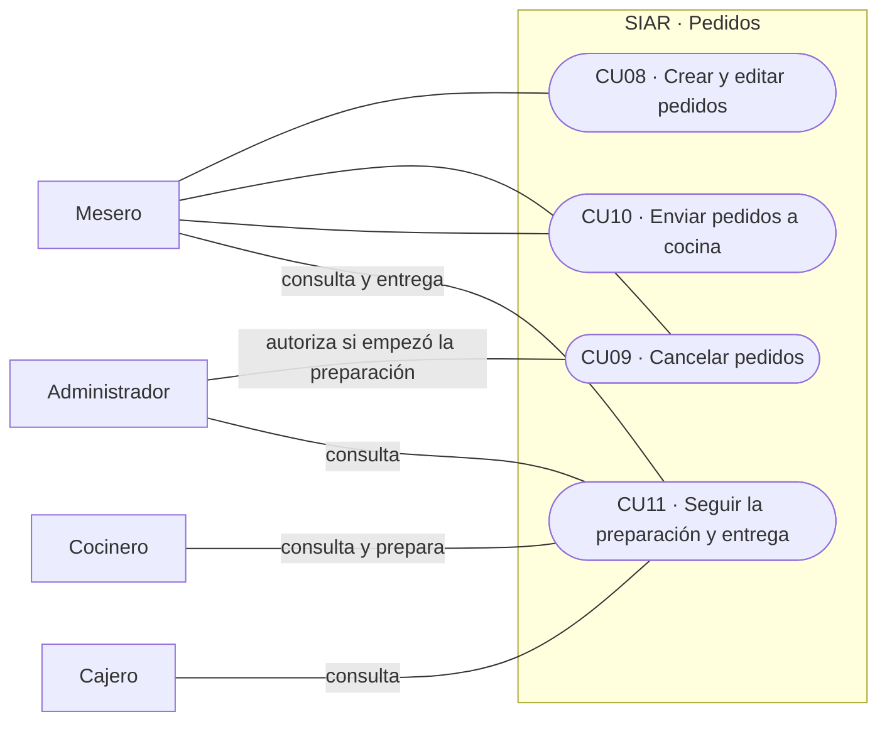
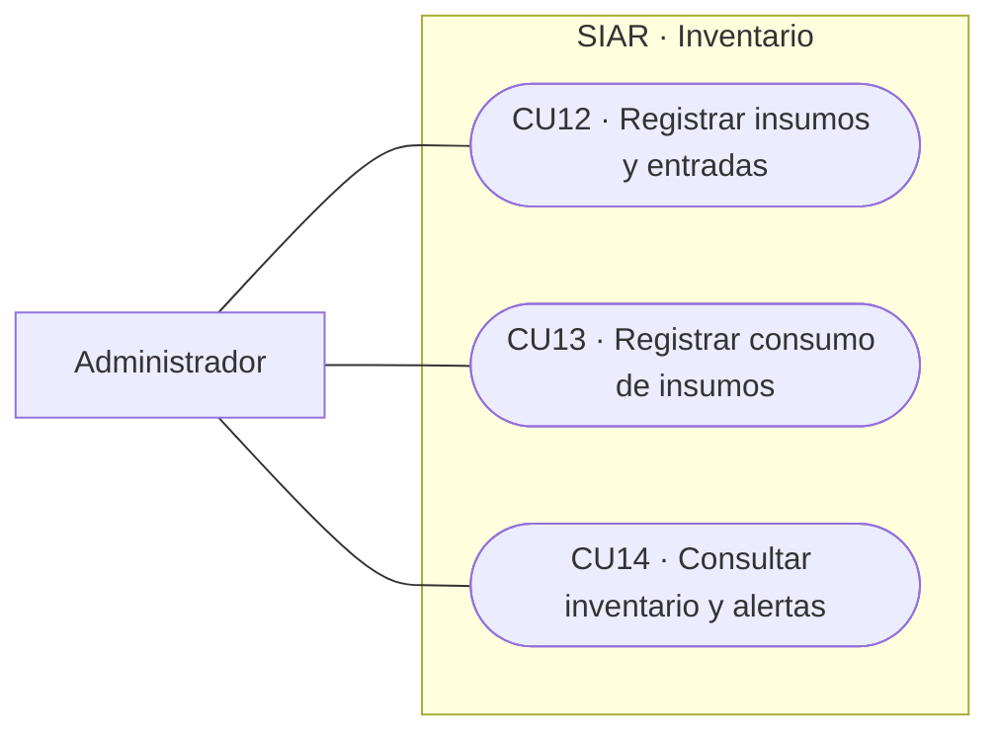
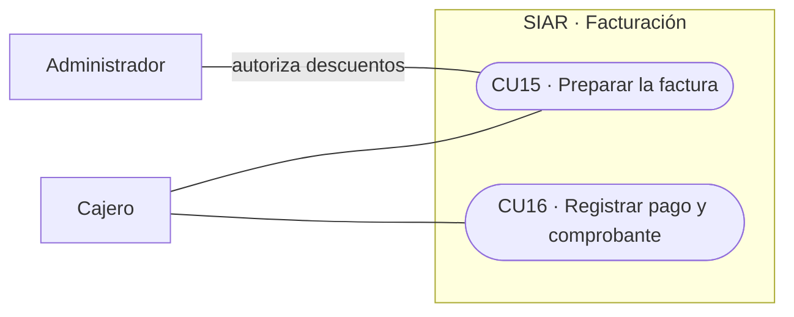
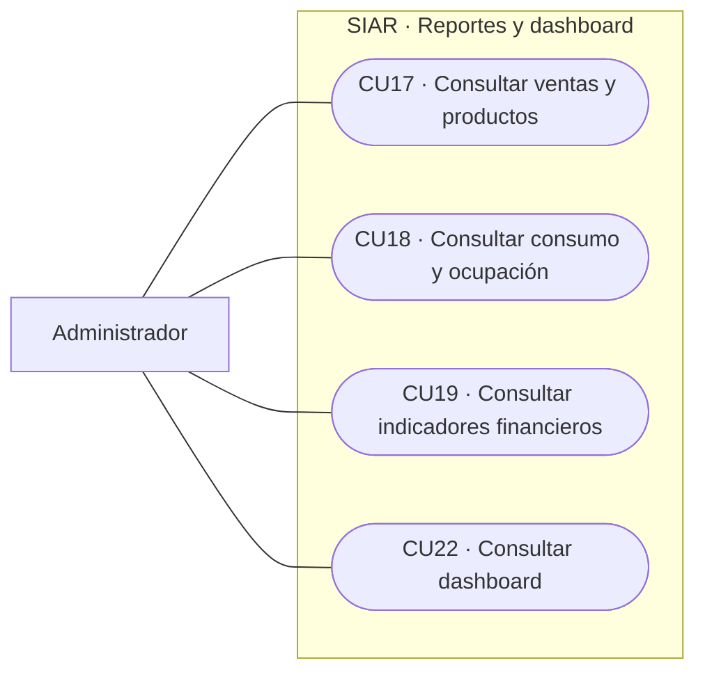
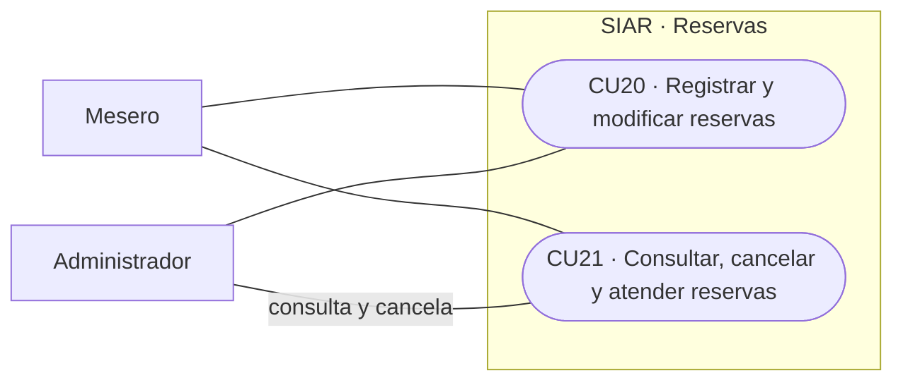

# Diagrama de casos de uso

Los actores son administrador, mesero, cocinero y cajero. **Usuario registrado** agrupa esos cuatro roles para ingresar y recuperar acceso; no es un rol adicional. El cliente recibe atención sin entrar al sistema.

Cada óvalo representa un caso de uso y cada línea indica participación, no el orden de los pasos. Las vistas pertenecen al mismo sistema. Los códigos CU coinciden con los [casos de uso](../02-ingenieria-de-requerimientos/02-casos-de-uso.md).

## 1. Acceso y cuentas

## 2. Menú y mesas

## 3. Pedidos

## 4. Inventario

## 5. Facturación

## 6. Reportes y dashboard

## 7. Reservas

## Reglas de participación

- Cada rol conserva sus permisos; el administrador no realiza automáticamente las tareas de los otros roles.
- En CU11, cocina marca En preparación y Listo; el mesero registra Entregado. El pago de CU16 deja el pedido Facturado.
- En CU21, solo el mesero registra la llegada y abre el pedido asociado a la reserva.
- Una autorización no reemplaza al actor que realiza la operación. No se cancela un pedido ya facturado.

Los detalles, errores y requisitos relacionados están en cada CU. Inventario, reservas y dashboard mantienen las propuestas pendientes de revisión indicadas en los requisitos.
