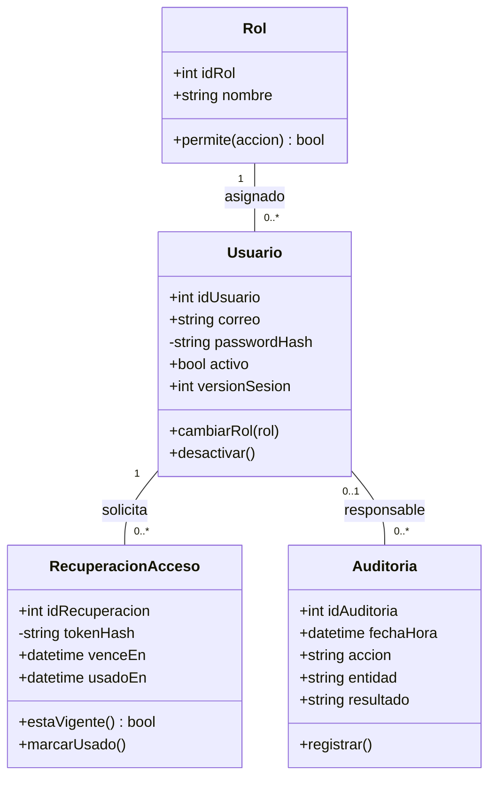
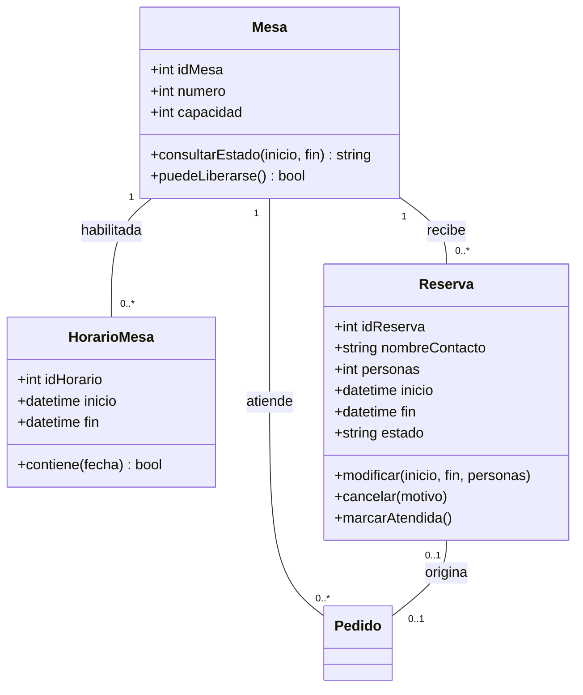
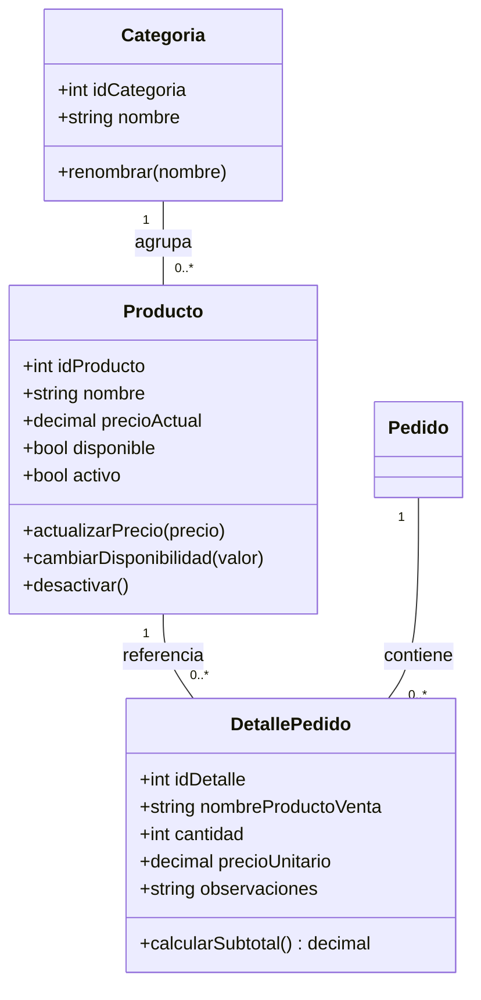
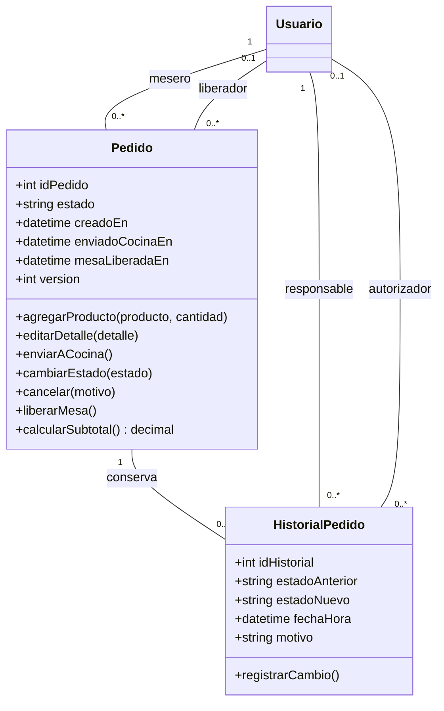
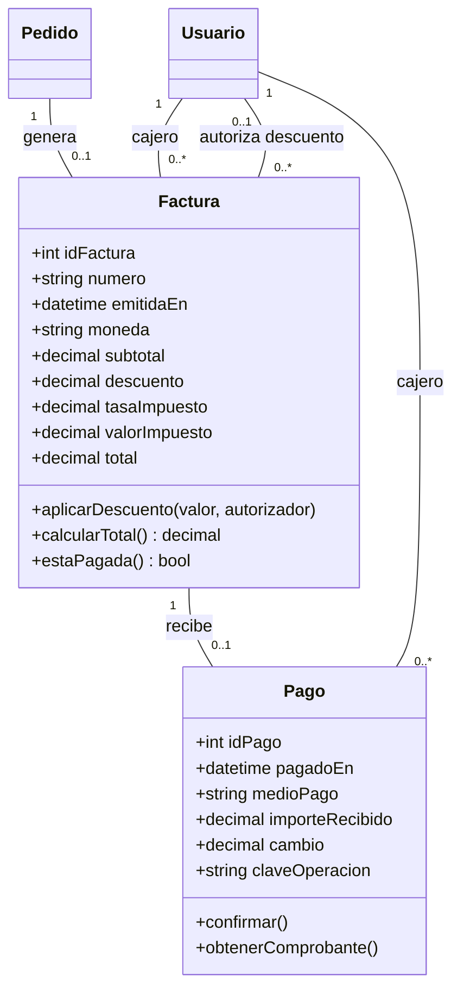
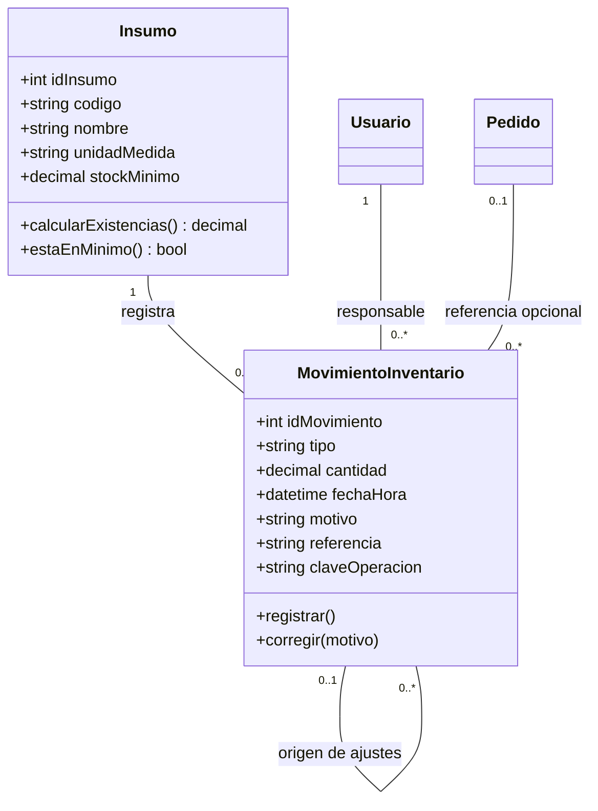

# Diagrama de clases

El modelo muestra las **16 clases del dominio**, sus datos principales y las operaciones propuestas. Las vistas son partes del mismo modelo: una clase repetida representa la misma clase. Todavía no hay código implementado.

`1` indica uno; `0..1`, uno opcional; y `0..*`, ninguno o varios. `+` indica acceso público y `-`, privado. Los nombres corresponden a las entidades del [modelo entidad-relación](modelo_entidad_relacion.md), donde se detallan todos los campos y claves.

## 1. Usuarios y seguridad

## 2. Mesas y reservas

## 3. Menú y detalle del pedido

## 4. Pedido e historial

## 5. Factura y pago

## 6. Inventario

## Reglas del modelo

- Cada usuario tiene un rol. Las operaciones requieren los permisos definidos en los requisitos; un método de clase no concede permisos por sí mismo.
- Reserva también se relaciona con un usuario creador obligatorio y un cancelador opcional. Estas relaciones se detallan en el modelo de datos.
- Puede haber muchos pedidos históricos por mesa, pero solo uno sin liberar. Una reserva origina como máximo un pedido de la misma mesa.
- El pedido guarda el nombre y precio de cada producto al agregarlo. Solo se edita Pendiente; para enviarlo debe tener productos disponibles. Los cambios de estado conservan su historial.
- El pedido y su historial se guardan juntos. Registrar la llegada también debe guardar el pedido y la reserva atendida en una sola operación.
- Solo un pedido Entregado genera factura. La factura admite un pago completo; confirmarlo cambia el pedido a Facturado. La mesa se libera por separado.
- Los descuentos necesitan autorización. Después del pago no se cambian la factura ni los productos cobrados.
- El inventario se calcula a partir de movimientos manuales y no admite saldo negativo. Corregir crea un ajuste, sin borrar el original. Cancelar un pedido no repone insumos automáticamente.
- Reportes y dashboard consultan estos datos; no son nuevas entidades. Las ventas se cuentan por la fecha de pago.

Las validaciones de permisos, horarios cruzados y cambios simultáneos se coordinarán en la capa de servicios. La organización de esa capa se explica en la [arquitectura del sistema](../04-diseno/arquitectura-del-sistema.md). Las herramientas siguen pendientes de elección.

## Relación con los requisitos

| Vista | Requisitos |
| --- | --- |
| Usuarios y seguridad | RF01–RF06; RNF04–RNF06. |
| Mesas y reservas | RF12–RF16; RF38–RF42. |
| Menú y pedidos | RF07–RF11; RF17–RF22. |
| Factura y pago | RF28–RF32. |
| Inventario | RF23–RF27. |
| Consultas derivadas | RF33–RF37; RF43–RF44. |

Las propuestas de inventario, reservas y dashboard conservan los puntos pendientes de revisión de los requerimientos.
