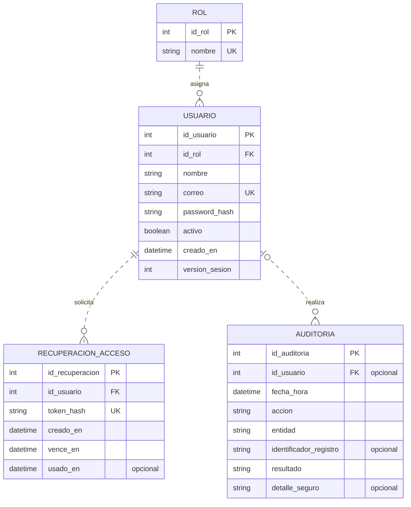
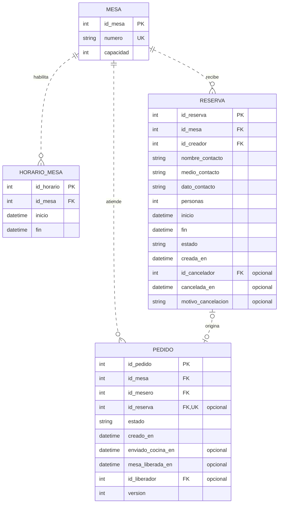
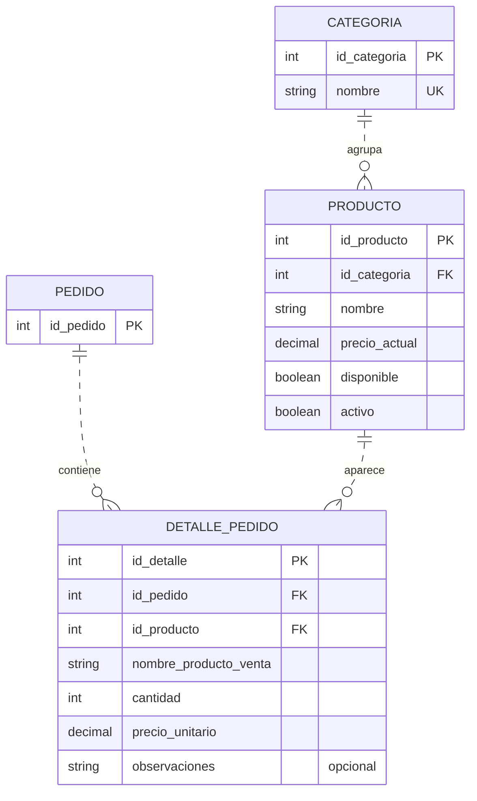
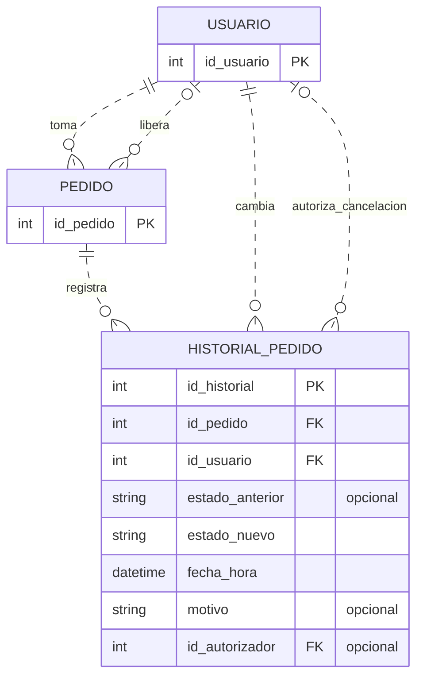
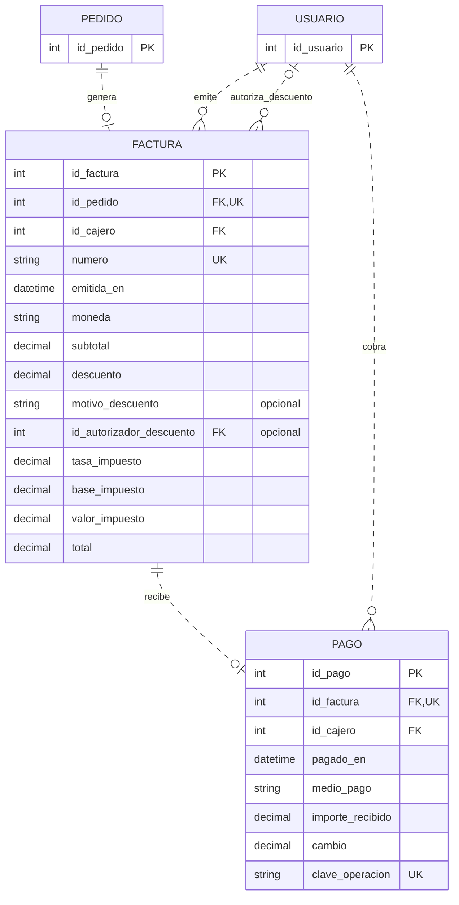
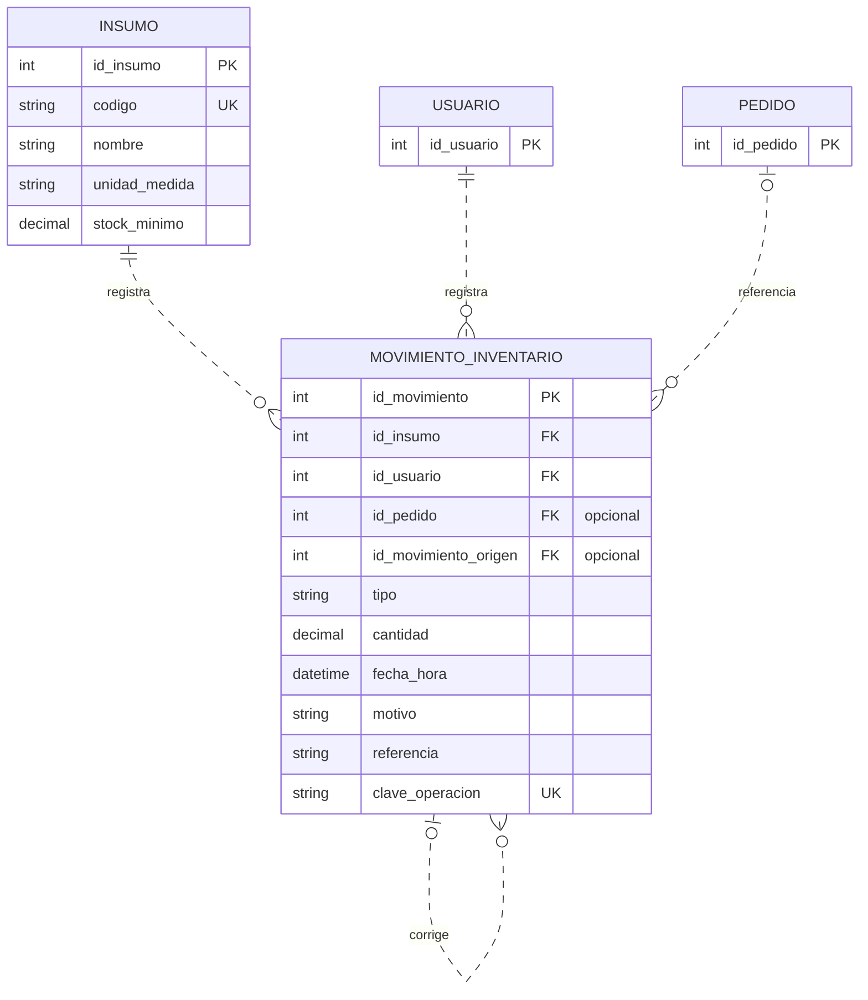

# Modelo entidad-relación de SIAR

## Propósito y alcance

Este modelo organiza los datos que necesitará el Sistema Integral de Administración para Restaurantes. Muestra qué información se guardará y cómo se relacionarán usuarios, menú, mesas, reservas, pedidos, inventario y facturación. Los reportes y el dashboard se obtendrán mediante consultas sobre esos datos.

Es una **propuesta de modelo lógico relacional para el primer corte**, basada en los [requerimientos funcionales](../02-ingenieria-de-requerimientos/03-requerimientos-funcionales.md) y [no funcionales](../02-ingenieria-de-requerimientos/04-requerimientos-no-funcionales.md). Todavía no es una base de datos implementada. Se mantienen como propuestas por validar las reglas de inventario, reservas, descuentos y recuperación de acceso indicadas en esos documentos.

El modelo contiene **16 entidades**. Se presenta en seis vistas del mismo modelo para facilitar su lectura; una entidad repetida no representa otra tabla. En cada vista se muestran completos los atributos del tema y solo la clave primaria de las entidades de referencia. La tabla de relaciones incluye también las conexiones entre vistas.

## Cómo leer los diagramas

- **PK:** clave primaria; identifica de forma única cada registro.
- **FK:** clave foránea; apunta a la clave primaria de otra entidad.
- **UK:** valor único; impide duplicados. En una FK opcional, la unicidad aplica únicamente a valores no nulos.
- **1:** exactamente un registro; **0..1:** ninguno o uno; **0..N:** ninguno o varios.
- En Mermaid, las barras representan uno, el círculo permite cero y la pata de cuervo representa muchos. Las líneas punteadas indican relaciones no identificadoras: cada entidad usa una clave primaria propia.
- Los tipos int, string, decimal, datetime y boolean son orientativos. Los campos marcados «opcional» aceptan ausencia de dato; los demás son obligatorios.
- Los importes se representarán con decimales exactos, no con números aproximados de coma flotante. Las cantidades de insumos pueden ser fraccionarias; las cantidades de productos del pedido son enteros positivos.

## Diagramas del modelo

### 1. Usuarios y seguridad

Un usuario tiene un rol y puede registrar varias solicitudes de recuperación. Un evento de auditoría puede carecer de usuario identificado, por ejemplo un acceso fallido. Esto no permite operaciones de negocio anónimas.

### 2. Mesas y reservas

Una mesa tiene muchos pedidos y reservas a lo largo del tiempo. Un pedido puede existir sin reserva. Una reserva puede no haberse atendido todavía y solo puede dar origen a un pedido. Los responsables de estas operaciones son claves hacia USUARIO, detalladas en la tabla de relaciones.

### 3. Menú y detalle del pedido

Cada detalle pertenece a un pedido y a un producto. Un pedido recién abierto puede estar vacío; para enviarlo a cocina necesita al menos una línea. El nombre y precio guardados en el detalle conservan la información de la venta aunque se edite el menú.

### 4. Historial y responsables del pedido

El historial guarda las transiciones, incluida la cancelación. El usuario que registra una acción y el administrador que autoriza una excepción pueden ser personas diferentes. El estado anterior solo es nulo en el registro inicial.

### 5. Facturación y pago

Un pedido tiene como máximo una factura; una factura puede estar pendiente de pago y admite como máximo un pago completo. La factura conserva los valores calculados y la autorización del descuento. El comprobante se genera con factura, pago y detalle del pedido.

### 6. Inventario

Cada movimiento corresponde a un insumo y a un responsable. La referencia al pedido es opcional, porque una entrada de mercancía no requiere pedido de cliente. Un ajuste puede señalar el movimiento que corrige. No se modelan recetas ni descuento automático de insumos.

## Diccionario de entidades

| Entidad | Información que representa | Clave primaria |
| --- | --- | --- |
| ROL | Define los cuatro roles del personal. | id_rol |
| USUARIO | Cuenta de un trabajador; el rol determina sus permisos. | id_usuario |
| RECUPERACION_ACCESO | Solicitud temporal de recuperación de contraseña. | id_recuperacion |
| AUDITORIA | Registro de operaciones y su resultado. | id_auditoria |
| MESA | Mesa física con número y capacidad. | id_mesa |
| HORARIO_MESA | Intervalos en que una mesa está habilitada para atención; permiten medir ocupación. | id_horario |
| RESERVA | Reserva de una mesa para un contacto y un intervalo. | id_reserva |
| PEDIDO | Atención de una mesa desde su apertura hasta el cierre y liberación. | id_pedido |
| CATEGORIA | Agrupa los productos del menú. | id_categoria |
| PRODUCTO | Producto que se ofrece en el menú; es distinto de un insumo. | id_producto |
| DETALLE_PEDIDO | Cada línea del pedido; resuelve la relación muchos a muchos entre pedidos y productos. | id_detalle |
| HISTORIAL_PEDIDO | Cambios de estado con su responsable y posibles autorizaciones. | id_historial |
| FACTURA | Documento interno académico generado para un pedido entregado. | id_factura |
| PAGO | Confirmación única del pago completo de una factura. | id_pago |
| INSUMO | Elemento del inventario, con unidad de medida fija y mínimo. | id_insumo |
| MOVIMIENTO_INVENTARIO | Entrada, salida o ajuste de un insumo; el saldo se obtiene de estos movimientos. | id_movimiento |

## Relaciones y cardinalidades

En la cuarta columna se indica cuántos registros hijos puede tener un registro padre. En la quinta se indica cuántos padres admite cada hijo. Todas las FK apuntan a la PK de la entidad padre.

| Padre | Hijo | FK en el hijo | Hijos por padre | Padres por hijo |
| --- | --- | --- | --- | --- |
| ROL | USUARIO | id_rol | 0..N | 1 |
| USUARIO | RECUPERACION_ACCESO | id_usuario | 0..N | 1 |
| USUARIO | AUDITORIA | id_usuario | 0..N | 0..1 |
| MESA | HORARIO_MESA | id_mesa | 0..N | 1 |
| MESA | RESERVA | id_mesa | 0..N | 1 |
| USUARIO | RESERVA | id_creador | 0..N | 1 |
| USUARIO | RESERVA | id_cancelador | 0..N | 0..1 |
| MESA | PEDIDO | id_mesa | 0..N | 1 |
| USUARIO | PEDIDO | id_mesero | 0..N | 1 |
| USUARIO | PEDIDO | id_liberador | 0..N | 0..1 |
| RESERVA | PEDIDO | id_reserva | 0..1 | 0..1 |
| CATEGORIA | PRODUCTO | id_categoria | 0..N | 1 |
| PEDIDO | DETALLE_PEDIDO | id_pedido | 0..N | 1 |
| PRODUCTO | DETALLE_PEDIDO | id_producto | 0..N | 1 |
| PEDIDO | HISTORIAL_PEDIDO | id_pedido | 0..N | 1 |
| USUARIO | HISTORIAL_PEDIDO | id_usuario | 0..N | 1 |
| USUARIO | HISTORIAL_PEDIDO | id_autorizador | 0..N | 0..1 |
| PEDIDO | FACTURA | id_pedido | 0..1 | 1 |
| USUARIO | FACTURA | id_cajero | 0..N | 1 |
| USUARIO | FACTURA | id_autorizador_descuento | 0..N | 0..1 |
| FACTURA | PAGO | id_factura | 0..1 | 1 |
| USUARIO | PAGO | id_cajero | 0..N | 1 |
| INSUMO | MOVIMIENTO_INVENTARIO | id_insumo | 0..N | 1 |
| USUARIO | MOVIMIENTO_INVENTARIO | id_usuario | 0..N | 1 |
| PEDIDO | MOVIMIENTO_INVENTARIO | id_pedido | 0..N | 0..1 |
| MOVIMIENTO_INVENTARIO | MOVIMIENTO_INVENTARIO | id_movimiento_origen | 0..N | 0..1 |

## Restricciones que debe respetar el diseño

### Usuarios y seguridad

1. ROL contiene Administrador, Mesero, Cocinero y Cajero. Cada USUARIO tiene un único rol en esta versión. Los permisos se aplican según la matriz de requerimientos; no se necesita una tabla de permisos mientras sean fijos.
2. El correo se normaliza antes de comprobar su unicidad. La contraseña se guarda como hash de contraseña con sal; nunca como texto legible. El hash codificado puede incluir la sal y los parámetros del algoritmo.
3. Desactivar un usuario no elimina pedidos, pagos, movimientos ni auditoría. Se impide desactivar o cambiar el rol del último administrador activo.
4. RECUPERACION_ACCESO almacena el hash del token, no el enlace completo ni el token en claro. Se valida que no esté usado y que no haya vencido. Se propone vigencia de 15 minutos, como en RF06. Al recuperar la contraseña se incrementa version_sesion y se invalidan sesiones anteriores; cada operación protegida consulta la versión y el rol vigentes.
5. AUDITORIA registra datos seguros de la operación, no contraseñas, tokens ni copias indiscriminadas de datos personales. entidad e identificador_registro son referencias descriptivas y **no son FK polimórficas**: una sola FK no puede apuntar a distintas tablas. id_usuario sí es una FK real. Se conserva la auditoría de cambios de reserva, de mesa y de autorizaciones.

### Mesas, reservas y ocupación

6. MESA.numero es único y capacidad es un entero positivo. HORARIO_MESA contiene intervalos de fecha y hora con inicio < fin, sin solapamientos para la misma mesa. Estos intervalos preservan el horario realmente habilitado para los reportes históricos; no se sobrescriben periodos pasados al cambiar el horario futuro.
7. RESERVA.personas debe ser positiva y no superar la capacidad de su mesa. Una reserva tiene una sola mesa; agrupar varias mesas queda fuera de esta propuesta. nombre_contacto, medio_contacto y dato_contacto registran la información necesaria sin crear una cuenta de cliente.
8. Los estados de reserva son Confirmada, Cancelada y Atendida. La creación o modificación valida capacidad, horario y conflictos. No pueden existir reservas confirmadas solapadas para la misma mesa. Cancelada exige id_cancelador, cancelada_en y motivo_cancelacion; en los otros estados esos campos permanecen nulos.
9. PEDIDO.id_reserva es opcional y único cuando tiene valor: admite pedidos sin reserva y evita atender una reserva dos veces. La mesa del pedido debe coincidir con la de la reserva vinculada. Registrar llegada, crear el pedido y cambiar la reserva a Atendida se realizan conjuntamente. Una reserva atendida no cambia de mesa ni horario por la función de edición.
10. La ocupación empieza en PEDIDO.creado_en y termina en mesa_liberada_en. id_liberador y mesa_liberada_en se completan juntos al liberar la mesa. Solo se libera si el pedido está Facturado o Cancelado. Una mesa admite como máximo un pedido sin liberar, aunque ya esté pagado; esto evita abrir otra atención sobre una mesa aún ocupada.
11. El estado visible de una mesa se **calcula**: ocupada si tiene un pedido sin liberar; reservada si una reserva Confirmada cubre el intervalo consultado; libre en caso contrario. Las reservas futuras no ocupan toda la jornada. La disponibilidad debe revisar tanto reservas como ocupación actual, y se vuelve a validar al guardar.
12. Para el reporte de ocupación se calcula la intersección de cada intervalo de atención con HORARIO_MESA y con el periodo consultado. Una atención todavía abierta se corta a la hora de consulta. El porcentaje es minutos ocupados / minutos habilitados × 100. Si no hay minutos habilitados, se informa que no es calculable.

### Menú y pedidos

13. PRODUCTO pertenece a una CATEGORIA. precio_actual es mayor o igual a cero. activo indica si sigue formando parte del menú; disponible indica si se puede pedir en ese momento. Para agregarlo o enviarlo a cocina se requieren ambos valores verdaderos.
14. DETALLE_PEDIDO resuelve la relación N:M entre PEDIDO y PRODUCTO. cantidad es un entero positivo y precio_unitario no es negativo. El mismo producto puede aparecer en varias líneas, por ejemplo con observaciones distintas; no se impone unicidad sobre el par pedido/producto.
15. nombre_producto_venta y precio_unitario se copian al agregar la línea. Su subtotal se calcula como cantidad × precio_unitario; no se almacena un segundo subtotal que pueda quedar desactualizado. El total preliminar del pedido es la suma de sus líneas.
16. Un pedido puede estar vacío al abrirse, por eso su cardinalidad con detalle es 0..N. Para enviarlo a cocina o facturarlo debe contener al menos una línea. Las líneas solo se modifican mientras el pedido esté Pendiente. La versión permite detectar cambios simultáneos incompatibles.
17. Los estados de pedido son Pendiente, En preparación, Listo, Entregado, Facturado y Cancelado. enviado_cocina_en se registra una sola vez y no cambia automáticamente el estado. HISTORIAL_PEDIDO registra la creación y las transiciones con fecha y responsable; actualizar el estado actual y guardar el historial forman una misma operación.
18. Para cancelar se exige motivo. Si la preparación ya empezó, el historial debe registrar id_autorizador de un administrador. Un pedido Facturado no se cancela con esta función. La asignación de roles y las transiciones permitidas requieren validación de negocio; una FK a USUARIO por sí sola no demuestra que esa persona sea mesero, cajero o administrador.

### Facturación

19. FACTURA.id_pedido es obligatorio y único: un pedido puede no tener factura todavía y nunca tendrá más de una. Se emite únicamente para un pedido Entregado. numero también es único.
20. La factura usa las líneas del pedido, que quedan congeladas para conservar nombre, cantidad y precio de la venta. No se duplica DETALLE_FACTURA en esta versión porque no hay facturación parcial, varias facturas por pedido ni edición de un pedido facturado. Si se incorpora alguna de esas funciones, deberá revisarse el modelo.
21. Los valores de FACTURA son una instantánea del cobro: subtotal = suma de líneas; 0 <= descuento <= subtotal; base_impuesto = subtotal − descuento; valor_impuesto = base_impuesto × tasa_impuesto; total = base_impuesto + valor_impuesto. Se aplica redondeo a dos decimales de manera consistente. La tasa se guarda como proporción y la moneda se identifica explícitamente. Tasa y política de descuentos se validarán con la docente.
22. Un descuento mayor que cero exige motivo_descuento y un id_autorizador_descuento correspondiente a un administrador. Antes del pago, cualquier cambio autorizado de descuento recalcula importes y genera auditoría. Después del pago, factura y detalle no se modifican.
23. PAGO.id_factura es obligatorio y único. Una factura está pendiente cuando no tiene PAGO, y pagada cuando lo tiene; no se mantiene otro estado redundante. Un pago es siempre confirmado, no un intento fallido.
24. El importe neto pagado es el total de FACTURA. En efectivo, importe_recibido >= total y cambio = importe_recibido − total. Para los otros medios registrados, importe_recibido = total y cambio = 0. El total cobrado de los reportes no usa el dinero entregado antes de devolver cambio.
25. clave_operacion evita repetir una confirmación. Registrar el pago y cambiar el pedido a Facturado se ejecutan en una sola transacción. El comprobante se genera a partir de la factura, su pedido y su pago; reimprimirlo no crea una venta ni una entidad adicional. Se trata del documento interno académico previsto en el alcance.

### Inventario

26. INSUMO.codigo es único; stock_minimo no es negativo. unidad_medida permanece fija después del primer movimiento para no mezclar unidades. PRODUCTO e INSUMO son entidades diferentes: uno se vende en el menú y el otro representa existencias. No hay relación automática entre ellos porque el alcance vigente no define recetas.
27. MOVIMIENTO_INVENTARIO usa cantidad positiva y tipo Entrada, Consumo, Salida, AjusteEntrada o AjusteSalida. El saldo se calcula como Entrada + AjusteEntrada − Consumo − Salida − AjusteSalida. La existencia inicial se registra como entrada. Cada movimiento representa un insumo.
28. El saldo es un dato calculado, no un campo independiente de INSUMO. Una salida se rechaza si deja saldo negativo; se debe comprobar y registrar de manera transaccional, serializando movimientos del mismo insumo.
29. id_pedido se completa cuando el movimiento corresponde a la atención de un pedido. id_movimiento_origen se utiliza en movimientos compensatorios para señalar lo corregido; debe pertenecer al mismo insumo, preceder al ajuste y no referirse al propio movimiento. Una corrección debe tener motivo y autorización operativa del administrador; no se borra ni se modifica el movimiento original.
30. clave_operacion es única para cada movimiento individual y se conserva al reintentar la misma operación. Si una entrada incluye varios insumos, se registra una clave por línea y se puede compartir referencia. Cancelar un pedido no devuelve automáticamente sus consumos.

### Integridad entre tablas

31. Todas las FK deben apuntar a registros existentes; se evita borrar en cascada historial de ventas, pedidos, reservas, pagos o inventario. Usuarios y productos con historial se desactivan.
32. Las UK opcionales, como PEDIDO.id_reserva, deben admitir múltiples nulos y evitar duplicados únicamente en los valores presentes. Su implementación exacta dependerá del motor elegido.
33. Las reservas sin solapamiento, un pedido sin liberar por mesa, los saldos suficientes y los permisos por rol no quedan garantizados solo por las cardinalidades. Requieren restricciones adicionales y operaciones transaccionales que se definirán durante el diseño físico.
34. Las fechas representan instantes coherentes; se propone guardar instantes en UTC y presentar o filtrar en la zona del restaurante. Los reportes diarios usarán America/Bogota si se confirma que el restaurante opera en Cali.

## Reportes y dashboard

No se crean tablas llamadas REPORTE o DASHBOARD: son resultados de consultas, no hechos nuevos del negocio.

| Información | Entidades utilizadas | Criterio |
| --- | --- | --- |
| Ventas por periodo | PAGO, FACTURA | Sumar FACTURA.total por fecha de pago. |
| Productos más vendidos | PAGO, FACTURA, PEDIDO, DETALLE_PEDIDO, PRODUCTO | Sumar cantidades de pedidos pagados por producto. |
| Consumo de inventario | MOVIMIENTO_INVENTARIO, INSUMO | Sumar solo tipo Consumo, por insumo y unidad. |
| Existencias y alertas | MOVIMIENTO_INVENTARIO, INSUMO | Comparar saldo calculado con stock_minimo, incluyendo insumos sin movimientos con saldo cero. |
| Ocupación de mesas | MESA, PEDIDO, HORARIO_MESA | Comparar tiempo ocupado con tiempo habilitado del periodo. |
| Ticket promedio | PAGO, FACTURA | Ventas cobradas / cantidad de pagos; sin pagos, promedio no disponible. |
| Reservas | RESERVA, MESA | Filtrar por fecha, intervalo y estado. |
| Pedidos activos | PEDIDO | Pendiente, En preparación, Listo o Entregado; Facturado y Cancelado no son pedidos activos. |
| Dashboard | Consultas anteriores | Combinar resultados y mostrar hora de actualización; distinguir estado actual de métricas del periodo. |

Una mesa puede seguir ocupada después de que su pedido deja de estar activo, hasta que el personal registre su liberación. Por eso el indicador de mesas ocupadas usa mesa_liberada_en y no solo el estado del pedido.

## Relación con los requisitos

| Requisitos | Soporte en el modelo |
| --- | --- |
| RF01–RF06 | ROL, USUARIO, RECUPERACION_ACCESO. |
| RF07–RF11 | CATEGORIA, PRODUCTO y precio/nombre histórico en DETALLE_PEDIDO. |
| RF12–RF16 | MESA, RESERVA, PEDIDO y sus datos de liberación. |
| RF17–RF22 | PEDIDO, DETALLE_PEDIDO, HISTORIAL_PEDIDO y responsables USUARIO. |
| RF23–RF27 | INSUMO y MOVIMIENTO_INVENTARIO. |
| RF28–RF32 | FACTURA, PAGO y detalle congelado del pedido. |
| RF33–RF37 | Consultas sobre pagos, facturas, detalles, movimientos, pedidos y HORARIO_MESA. |
| RF38–RF42 | RESERVA y vínculo único opcional con PEDIDO. |
| RF43–RF44 | Consultas del dashboard sobre las entidades anteriores. |
| RNF04–RNF06 | Hash de contraseña, versión de sesión, rol, recuperación y AUDITORIA. |

## Ejemplo para explicarlo en clase

Un mesero abre un pedido para la mesa 4. Agrega dos productos, que se guardan como dos líneas en DETALLE_PEDIDO. Cocina registra los cambios de estado en HISTORIAL_PEDIDO. Cuando se entrega la comida, el cajero genera una factura y registra su pago. Después, el personal libera la mesa y queda registrada la duración de la atención.

Si los clientes tenían reserva, el pedido guarda su identificador; si llegaron sin reservar, ese campo queda vacío. Los insumos utilizados se registran manualmente mediante movimientos de inventario, como se definió en los requerimientos.

## Decisiones para revisar con el equipo

- Confirmar las reglas propuestas de inventario y reservas de los documentos de requerimientos.
- Confirmar una sola mesa por reserva, un pedido por atención y un solo pago completo por factura.
- Confirmar el registro de intervalos habilitados por mesa para calcular ocupación.
- Definir el motor de base de datos, longitudes de texto, precisión decimal e índices en una etapa posterior.
- Mantener el alcance sin recetas, pagos parciales, devoluciones ni integraciones externas; cualquier ampliación requiere revisar requisitos y modelo.

El cronograma se completará al final, según lo acordado.

## Referencias del modelo

- [Requerimientos funcionales de SIAR](../02-ingenieria-de-requerimientos/03-requerimientos-funcionales.md).
- [Requerimientos no funcionales de SIAR](../02-ingenieria-de-requerimientos/04-requerimientos-no-funcionales.md).
- [Alcance del proyecto](../01-documento-de-inicio/alcance.md).
- [Sintaxis oficial de diagramas entidad-relación de Mermaid](https://mermaid.js.org/syntax/entityRelationshipDiagram.html).
