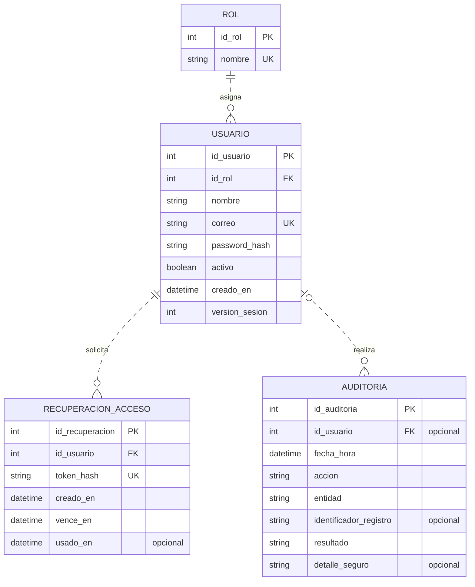
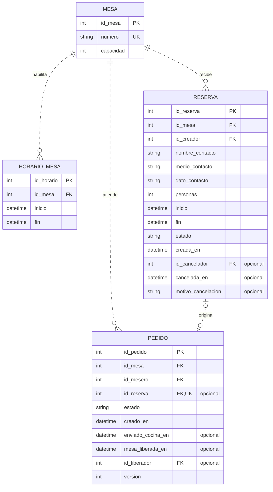
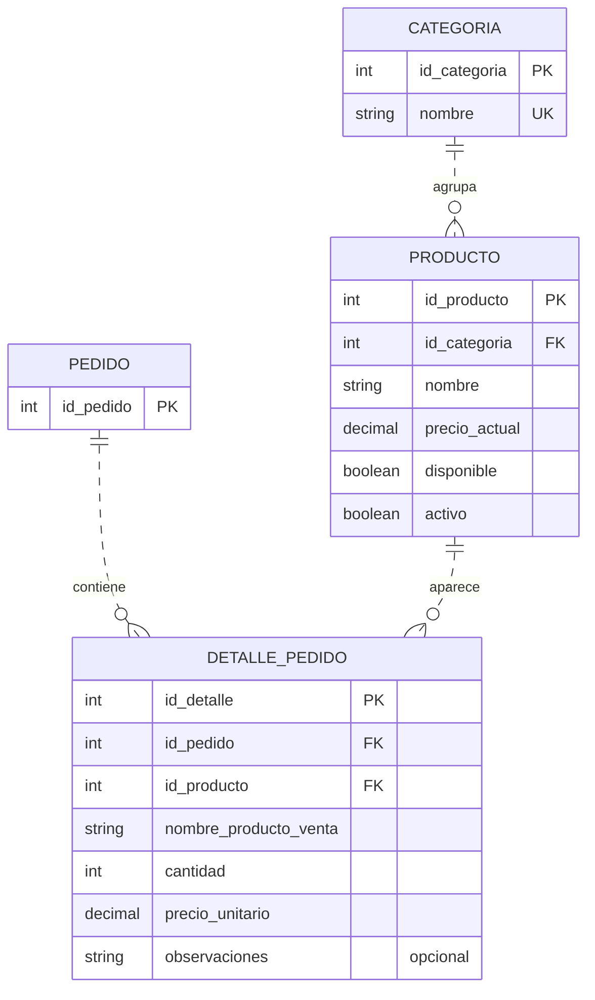
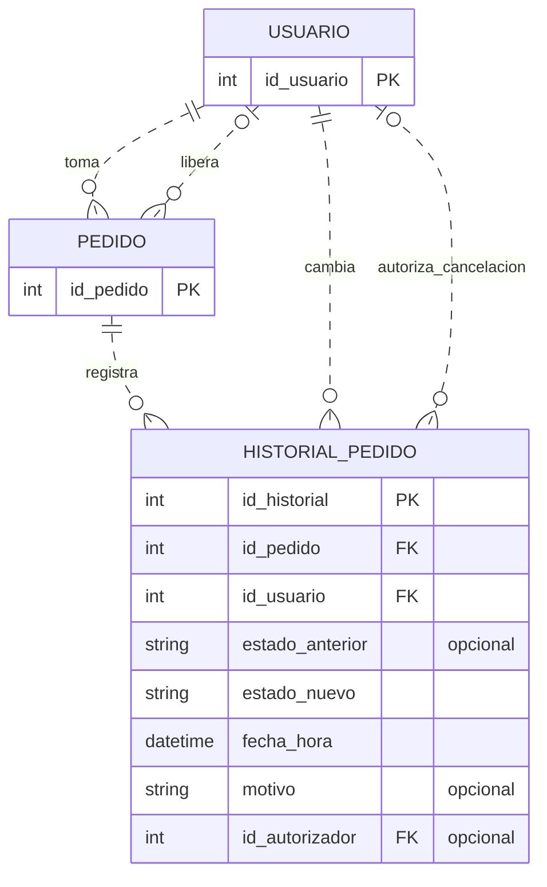
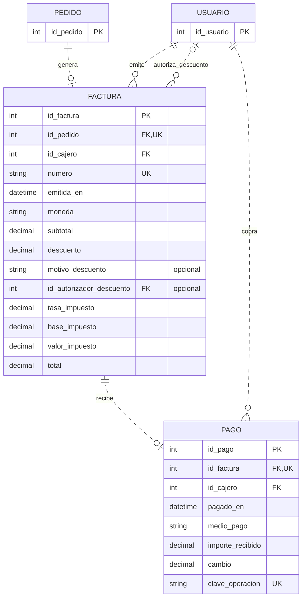
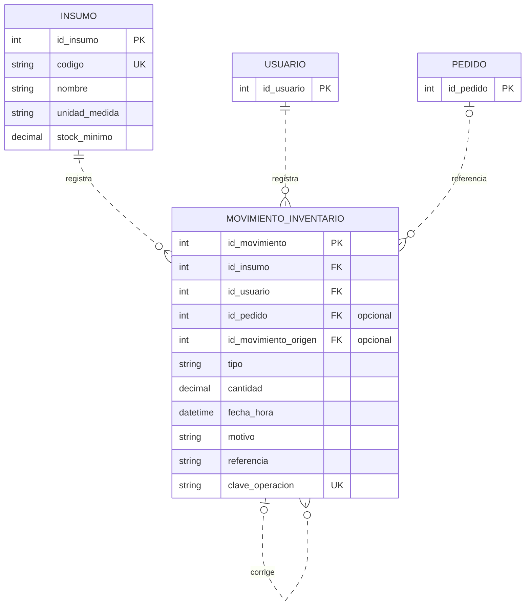

# Modelo entidad-relación de SIAR

El modelo define los datos de SIAR y sus relaciones.

Lo organizamos a partir de los [requerimientos funcionales](../02-ingenieria-de-requerimientos/03-requerimientos-funcionales.md) y los [no funcionales](../02-ingenieria-de-requerimientos/04-requerimientos-no-funcionales.md). Por ahora es el diseño de los datos; todavía no hemos creado la base de datos.

Tenemos **16 entidades**, que se podrán convertir en tablas. Presentamos el mismo modelo en seis partes para que sea más fácil leerlo. Si una entidad aparece otra vez, sigue siendo la misma tabla. En cada parte mostramos sus datos principales; las tablas que solo sirven de referencia muestran únicamente su identificador.

## Qué significan los símbolos

| Símbolo o término | Explicación |
| --- | --- |
| PK o clave primaria | Es el dato que identifica un registro, como id_pedido. No se repite dentro de su tabla. |
| FK o clave foránea | Es un dato que conecta una tabla con otra. Por ejemplo, id_mesa en PEDIDO indica a qué mesa pertenece. |
| UK o valor único | Señala un dato que no se puede repetir, como el correo de un usuario. |
| 1 | Debe existir exactamente un registro relacionado. |
| 0..1 | Puede no existir todavía, pero habrá como máximo uno. |
| 0..N | Puede no haber ninguno o haber varios. |
| Opcional | El dato puede quedar vacío cuando no corresponde. Los demás datos son obligatorios. |

En las líneas del diagrama, las barras representan uno, el círculo permite cero y la forma de tres puntas representa varios. Las líneas punteadas indican que cada tabla tiene su propio identificador.

int representa números enteros; decimal, números con decimales; string, texto; datetime, fecha y hora; y boolean, verdadero o falso. Los precios usarán decimales exactos. Las cantidades de los insumos pueden tener decimales, mientras que las cantidades pedidas de un producto deben ser enteras.

Si una clave foránea es opcional y única, varios registros pueden tenerla vacía, pero no pueden repetir el mismo valor cuando se complete.

## Diagramas

### 1. Usuarios y seguridad

Cada trabajador tiene una cuenta y un rol. Si olvida la contraseña, puede pedir su recuperación. AUDITORIA guarda quién hizo una acción y cuándo. Si alguien intenta entrar y no se identifica, ese registro puede quedar sin usuario; esto no le permite hacer tareas del restaurante.

```mermaid
erDiagram
    direction TB
    ROL ||..o{ USUARIO : asigna
    USUARIO ||..o{ RECUPERACION_ACCESO : solicita
    USUARIO |o..o{ AUDITORIA : realiza

    ROL {
        int id_rol PK
        string nombre UK
    }
    USUARIO {
        int id_usuario PK
        int id_rol FK
        string nombre
        string correo UK
        string password_hash
        boolean activo
        datetime creado_en
        int version_sesion
    }
    RECUPERACION_ACCESO {
        int id_recuperacion PK
        int id_usuario FK
        string token_hash UK
        datetime creado_en
        datetime vence_en
        datetime usado_en "opcional"
    }
    AUDITORIA {
        int id_auditoria PK
        int id_usuario FK "opcional"
        datetime fecha_hora
        string accion
        string entidad
        string identificador_registro "opcional"
        string resultado
        string detalle_seguro "opcional"
    }
```

### 2. Mesas y reservas

Una mesa puede tener muchas reservas y pedidos en diferentes momentos. Una reserva puede terminar en un pedido cuando llegan los clientes. También se puede abrir un pedido sin reserva. Los horarios indican cuándo está habilitada cada mesa para atender.

```mermaid
erDiagram
    direction TB
    MESA ||..o{ HORARIO_MESA : habilita
    MESA ||..o{ RESERVA : recibe
    MESA ||..o{ PEDIDO : atiende
    RESERVA |o..o| PEDIDO : origina

    MESA {
        int id_mesa PK
        string numero UK
        int capacidad
    }
    HORARIO_MESA {
        int id_horario PK
        int id_mesa FK
        datetime inicio
        datetime fin
    }
    RESERVA {
        int id_reserva PK
        int id_mesa FK
        int id_creador FK
        string nombre_contacto
        string medio_contacto
        string dato_contacto
        int personas
        datetime inicio
        datetime fin
        string estado
        datetime creada_en
        int id_cancelador FK "opcional"
        datetime cancelada_en "opcional"
        string motivo_cancelacion "opcional"
    }
    PEDIDO {
        int id_pedido PK
        int id_mesa FK
        int id_mesero FK
        int id_reserva FK, UK "opcional"
        string estado
        datetime creado_en
        datetime enviado_cocina_en "opcional"
        datetime mesa_liberada_en "opcional"
        int id_liberador FK "opcional"
        int version
    }
```

### 3. Menú y detalle del pedido

Una categoría agrupa productos del menú. DETALLE_PEDIDO guarda cada producto que se agrega a un pedido, su cantidad y precio. Un pedido recién abierto puede estar vacío, pero necesita productos para enviarse a cocina.

```mermaid
erDiagram
    direction TB
    CATEGORIA ||..o{ PRODUCTO : agrupa
    PEDIDO ||..o{ DETALLE_PEDIDO : contiene
    PRODUCTO ||..o{ DETALLE_PEDIDO : aparece

    CATEGORIA {
        int id_categoria PK
        string nombre UK
    }
    PRODUCTO {
        int id_producto PK
        int id_categoria FK
        string nombre
        decimal precio_actual
        boolean disponible
        boolean activo
    }
    DETALLE_PEDIDO {
        int id_detalle PK
        int id_pedido FK
        int id_producto FK
        string nombre_producto_venta
        int cantidad
        decimal precio_unitario
        string observaciones "opcional"
    }
    PEDIDO {
        int id_pedido PK
    }
```

### 4. Cambios y responsables del pedido

HISTORIAL_PEDIDO guarda los cambios de estado, con fecha y responsable. Por ejemplo, permite saber quién lo pasó a En preparación. Si una cancelación necesita permiso del administrador, también se guarda quién la autorizó.

```mermaid
erDiagram
    direction TB
    USUARIO ||..o{ PEDIDO : toma
    USUARIO |o..o{ PEDIDO : libera
    PEDIDO ||..o{ HISTORIAL_PEDIDO : registra
    USUARIO ||..o{ HISTORIAL_PEDIDO : cambia
    USUARIO |o..o{ HISTORIAL_PEDIDO : autoriza_cancelacion

    HISTORIAL_PEDIDO {
        int id_historial PK
        int id_pedido FK
        int id_usuario FK
        string estado_anterior "opcional"
        string estado_nuevo
        datetime fecha_hora
        string motivo "opcional"
        int id_autorizador FK "opcional"
    }
    PEDIDO {
        int id_pedido PK
    }
    USUARIO {
        int id_usuario PK
    }
```

### 5. Facturación y pago

Un pedido puede tener una factura. Si aún no se ha cobrado, esa factura no tiene pago. Cuando se cobra, se registra un solo pago completo. Los datos de la factura, el pedido y el pago sirven para mostrar el comprobante.

```mermaid
erDiagram
    direction TB
    PEDIDO ||..o| FACTURA : genera
    USUARIO ||..o{ FACTURA : emite
    USUARIO |o..o{ FACTURA : autoriza_descuento
    FACTURA ||..o| PAGO : recibe
    USUARIO ||..o{ PAGO : cobra

    FACTURA {
        int id_factura PK
        int id_pedido FK, UK
        int id_cajero FK
        string numero UK
        datetime emitida_en
        string moneda
        decimal subtotal
        decimal descuento
        string motivo_descuento "opcional"
        int id_autorizador_descuento FK "opcional"
        decimal tasa_impuesto
        decimal base_impuesto
        decimal valor_impuesto
        decimal total
    }
    PAGO {
        int id_pago PK
        int id_factura FK, UK
        int id_cajero FK
        datetime pagado_en
        string medio_pago
        decimal importe_recibido
        decimal cambio
        string clave_operacion UK
    }
    PEDIDO {
        int id_pedido PK
    }
    USUARIO {
        int id_usuario PK
    }
```

### 6. Inventario

INSUMO representa lo que se guarda en inventario. MOVIMIENTO_INVENTARIO registra lo que entra, sale o se corrige. Cada movimiento tiene un responsable y puede relacionarse con un pedido cuando corresponda. El consumo se anota manualmente.

```mermaid
erDiagram
    direction TB
    INSUMO ||..o{ MOVIMIENTO_INVENTARIO : registra
    USUARIO ||..o{ MOVIMIENTO_INVENTARIO : registra
    PEDIDO |o..o{ MOVIMIENTO_INVENTARIO : referencia
    MOVIMIENTO_INVENTARIO |o..o{ MOVIMIENTO_INVENTARIO : corrige

    INSUMO {
        int id_insumo PK
        string codigo UK
        string nombre
        string unidad_medida
        decimal stock_minimo
    }
    MOVIMIENTO_INVENTARIO {
        int id_movimiento PK
        int id_insumo FK
        int id_usuario FK
        int id_pedido FK "opcional"
        int id_movimiento_origen FK "opcional"
        string tipo
        decimal cantidad
        datetime fecha_hora
        string motivo
        string referencia
        string clave_operacion UK
    }
    PEDIDO {
        int id_pedido PK
    }
    USUARIO {
        int id_usuario PK
    }
```

## Qué guarda cada entidad

| Entidad | Qué guarda | Identificador |
| --- | --- | --- |
| ROL | Los cuatro roles del personal. | id_rol |
| USUARIO | La cuenta de cada trabajador. | id_usuario |
| RECUPERACION_ACCESO | La solicitud y el plazo para cambiar una contraseña olvidada. | id_recuperacion |
| AUDITORIA | Quién hizo una acción, cuándo y qué resultado tuvo. | id_auditoria |
| MESA | El número y la capacidad de una mesa. | id_mesa |
| HORARIO_MESA | Las fechas y horas en que se puede atender en una mesa. | id_horario |
| RESERVA | Quién reserva, cuántas personas van y qué mesa y horario usarán. | id_reserva |
| PEDIDO | Lo que se atiende en una mesa y el seguimiento hasta liberarla. | id_pedido |
| CATEGORIA | El grupo al que pertenece un producto del menú. | id_categoria |
| PRODUCTO | Lo que se ofrece en el menú, con precio y disponibilidad. | id_producto |
| DETALLE_PEDIDO | Los productos de un pedido, con cantidad, nombre y precio de ese momento. | id_detalle |
| HISTORIAL_PEDIDO | Los estados por los que pasó el pedido y quién los cambió. | id_historial |
| FACTURA | Los valores que se cobran por un pedido. | id_factura |
| PAGO | El registro del pago completo de una factura. | id_pago |
| INSUMO | Un elemento del inventario, su unidad de medida y su mínimo. | id_insumo |
| MOVIMIENTO_INVENTARIO | La entrada, salida o corrección de un insumo. | id_movimiento |

## Cómo se relacionan las tablas

Cada FK de la tercera columna apunta al identificador de la tabla de referencia. Por ejemplo, un ROL puede estar asignado a varios USUARIO, pero cada usuario tiene un solo rol. Esta tabla también incluye las conexiones que no aparecen juntas en un mismo diagrama.

| Tabla de referencia | Tabla que la usa | Dato que las conecta | Cuántos registros puede tener relacionados | Cuántas referencias admite cada registro |
| --- | --- | --- | --- | --- |
| ROL | USUARIO | id_rol | 0..N | 1 |
| USUARIO | RECUPERACION_ACCESO | id_usuario | 0..N | 1 |
| USUARIO | AUDITORIA | id_usuario | 0..N | 0..1 |
| MESA | HORARIO_MESA | id_mesa | 0..N | 1 |
| MESA | RESERVA | id_mesa | 0..N | 1 |
| USUARIO | RESERVA | id_creador | 0..N | 1 |
| USUARIO | RESERVA | id_cancelador | 0..N | 0..1 |
| MESA | PEDIDO | id_mesa | 0..N | 1 |
| USUARIO | PEDIDO | id_mesero | 0..N | 1 |
| USUARIO | PEDIDO | id_liberador | 0..N | 0..1 |
| RESERVA | PEDIDO | id_reserva | 0..1 | 0..1 |
| CATEGORIA | PRODUCTO | id_categoria | 0..N | 1 |
| PEDIDO | DETALLE_PEDIDO | id_pedido | 0..N | 1 |
| PRODUCTO | DETALLE_PEDIDO | id_producto | 0..N | 1 |
| PEDIDO | HISTORIAL_PEDIDO | id_pedido | 0..N | 1 |
| USUARIO | HISTORIAL_PEDIDO | id_usuario | 0..N | 1 |
| USUARIO | HISTORIAL_PEDIDO | id_autorizador | 0..N | 0..1 |
| PEDIDO | FACTURA | id_pedido | 0..1 | 1 |
| USUARIO | FACTURA | id_cajero | 0..N | 1 |
| USUARIO | FACTURA | id_autorizador_descuento | 0..N | 0..1 |
| FACTURA | PAGO | id_factura | 0..1 | 1 |
| USUARIO | PAGO | id_cajero | 0..N | 1 |
| INSUMO | MOVIMIENTO_INVENTARIO | id_insumo | 0..N | 1 |
| USUARIO | MOVIMIENTO_INVENTARIO | id_usuario | 0..N | 1 |
| PEDIDO | MOVIMIENTO_INVENTARIO | id_pedido | 0..N | 0..1 |
| MOVIMIENTO_INVENTARIO | MOVIMIENTO_INVENTARIO | id_movimiento_origen | 0..N | 0..1 |

## Reglas para guardar los datos

Estas reglas explican las decisiones del modelo. Las que aún no están definidas en la guía siguen siendo propuestas para revisar con la docente.

### Usuarios y acceso

1. Los roles serán Administrador, Mesero, Cocinero y Cajero. Cada usuario tendrá uno solo. Los permisos serán los acordados en los requerimientos, por eso no agregamos una tabla de permisos por ahora.
2. Antes de comparar correos, usaremos el mismo formato para evitar duplicados. La contraseña se guardará como hash, un valor que permite comprobarla sin guardar el texto original. El hash incluirá la información de protección que necesite el método elegido, como la sal y sus parámetros.
3. Desactivar una cuenta no borra sus pedidos, pagos ni movimientos. Tampoco se permite dejar el sistema sin un administrador activo.
4. Para recuperar el acceso se guardará un hash del token, que es el código temporal del enlace. No se guarda el enlace completo ni el código en texto legible. Se revisa si ya se usó o venció; proponemos 15 minutos de duración. Al cambiar la contraseña, version_sesion aumenta para dejar sin validez las sesiones anteriores. El sistema revisará esa versión y el rol antes de cada acción protegida.
5. AUDITORIA guardará solo los datos necesarios para explicar una acción. No debe incluir contraseñas, códigos de recuperación ni copias innecesarias de datos personales. Sus campos entidad e identificador_registro describen lo afectado, pero no son claves foráneas, porque pueden referirse a tablas distintas. id_usuario sí conecta con USUARIO.

### Mesas y reservas

6. Cada mesa tiene un número único y una capacidad entera mayor que cero. Sus horarios deben tener inicio antes del fin y no cruzarse entre sí. Los horarios pasados se conservan para poder revisar después cuánto se usó la mesa.
7. Una reserva corresponde a una mesa. La cantidad de personas debe ser positiva y caber en ella. Se guardan nombre y contacto sin crear una cuenta de cliente. Por ahora no se agrupan varias mesas en una reserva.
8. Los estados de reserva son Confirmada, Cancelada y Atendida. Al registrar o modificar se revisan capacidad, horario y otras reservas. No se confirman dos reservas que se crucen en la misma mesa. Si se cancela, se guardan responsable, fecha y motivo; en los demás estados esos datos quedan vacíos.
9. El pedido puede tener id_reserva vacío si el cliente llegó sin reservar. Cuando tenga reserva, su identificador no podrá repetirse en otro pedido y ambos deben tener la misma mesa. La llegada, el pedido y el cambio a Atendida se guardan juntos. Una reserva atendida ya no cambia de mesa u horario desde la función de edición.
10. La atención empieza en creado_en del pedido y termina en mesa_liberada_en. Al liberar se guarda también id_liberador. Solo se libera si el pedido está Facturado o Cancelado. Una mesa no debe tener dos pedidos sin liberar, incluso si el primero ya se pagó.
11. El estado visible de la mesa se calcula: ocupada si tiene un pedido sin liberar; reservada si una reserva Confirmada coincide con el horario consultado; libre en los demás casos. Una reserva futura no bloquea toda la jornada. Se revisa de nuevo la disponibilidad al guardar.
12. Para calcular la ocupación, se cuenta solo el tiempo de atención que coincide con el horario habilitado y las fechas consultadas. Si la mesa sigue ocupada, se cuenta hasta la hora actual. El porcentaje es minutos ocupados / minutos habilitados × 100. Si no hay tiempo habilitado, no se calcula.

### Menú y pedidos

13. Cada producto tiene una categoría y un precio que no puede ser negativo. activo indica si sigue en el menú; disponible, si se puede pedir en ese momento. Para agregarlo o enviarlo a cocina, los dos deben ser verdaderos.
14. Un pedido puede tener varios productos y un producto puede estar en varios pedidos. DETALLE_PEDIDO conecta ambos y guarda cada línea. La cantidad debe ser un entero positivo y el precio no puede ser negativo. Un mismo producto puede aparecer en varias líneas si tiene observaciones diferentes.
15. Al agregar el producto, guardamos su nombre y precio de ese momento. Así, si el menú cambia después, no se cambia la venta anterior. El valor de la línea se calcula con cantidad × precio; el del pedido es la suma de las líneas.
16. Un pedido recién abierto puede estar vacío, por eso la relación con sus detalles es 0..N. Para enviarlo o facturarlo debe tener al menos un producto. Solo se edita mientras esté Pendiente. El campo version ayuda a detectar si otra persona ya cambió el pedido.
17. El pedido pasa por Pendiente, En preparación, Listo, Entregado y Facturado, o termina como Cancelado. La fecha de envío a cocina se guarda una sola vez y no cambia por sí sola el estado. El historial registra la creación y cada cambio con su responsable y hora. El estado anterior queda vacío solo al crear el pedido. El nuevo estado y su historial se guardan juntos.
18. Una cancelación necesita motivo. Si la preparación empezó, se guarda quién la autorizó como administrador. Un pedido Facturado no se cancela desde esta función. El sistema debe revisar el rol: tener un identificador de usuario no demuestra por sí solo que esa persona tenga permiso.

### Facturas y pagos

19. Cada factura pertenece a un pedido y un pedido tiene como máximo una factura. Solo se genera para un pedido Entregado. El número de factura no se repite.
20. La factura usa los productos guardados en DETALLE_PEDIDO. Cuando se factura, ese detalle se conserva sin cambios. No agregamos otra tabla de detalle de factura porque no tenemos facturas parciales ni varias facturas para el mismo pedido. Si eso cambia, tendremos que revisar el modelo.
21. La factura conserva los valores del cobro: subtotal = suma de las líneas; descuento entre cero y el subtotal; base = subtotal − descuento; impuesto = base × tasa; total = base + impuesto. Se usa el mismo redondeo a dos decimales. La tasa se guarda como proporción y se indica la moneda. La tasa y los descuentos deben acordarse con la docente.
22. Si hay descuento, debe tener motivo y autorización de un administrador. Antes del pago, un cambio autorizado de descuento vuelve a calcular los valores y queda registrado. Después del pago, no se modifican la factura ni los productos cobrados.
23. Una factura sin PAGO está pendiente; una con PAGO está pagada. Por eso no guardamos otro estado que repita esa información. Cada factura tiene como máximo un pago y solo se guardan los pagos confirmados.
24. Lo cobrado por la venta es el total de la factura. En efectivo, el dinero recibido debe alcanzar y el cambio es recibido − total. En otros medios, se registra el total exacto y cambio cero. Para los reportes se usa lo cobrado, no el efectivo entregado antes de devolver el cambio.
25. clave_operacion permite reconocer un pago que ya se confirmó para no repetirlo. El pago y el cambio a Facturado se guardan juntos o no se guarda ninguno. El comprobante sale de esos datos; imprimirlo otra vez no crea otra venta. Sigue siendo la factura interna prevista para el proyecto.

### Inventario

26. Cada insumo tiene un código único y un mínimo que no puede ser negativo. Su unidad de medida no cambia después del primer movimiento, para no mezclar cantidades. PRODUCTO es lo que se vende e INSUMO es lo que se controla en inventario. No se relacionan automáticamente porque todavía no hemos definido recetas.
27. Cada movimiento corresponde a un insumo y lleva una cantidad positiva. Los tipos son Entrada, Consumo, Salida, AjusteEntrada y AjusteSalida. Lo disponible se calcula con entradas + ajustes de entrada − consumos − salidas − ajustes de salida. Lo que haya al comenzar se registra como entrada.
28. La cantidad disponible se obtiene de los movimientos; no se guarda otro saldo independiente en INSUMO. Una salida no puede dejar cantidades negativas. Si llegan dos movimientos para el mismo insumo a la vez, se deben atender en orden, comprobando y guardando cada uno completo.
29. Si el movimiento corresponde a un pedido, se guarda id_pedido. Si corrige otro movimiento, id_movimiento_origen señala cuál: debe ser anterior, del mismo insumo y distinto del ajuste. La corrección la realiza el administrador con su motivo, sin borrar el movimiento original.
30. clave_operacion identifica cada movimiento para no repetirlo al intentar guardar otra vez. Si una entrada incluye varios insumos, cada línea tendrá su clave y podrá compartir la referencia. Cancelar un pedido no devuelve automáticamente los insumos.

### Cuidado de las relaciones

31. Las claves foráneas deben apuntar a registros existentes. Borrar un dato no debe llevarse su historial de pedidos, reservas, facturas, pagos o inventario. Usuarios y productos con historial se desactivan.
32. Un dato opcional y único, como id_reserva en PEDIDO, puede quedar vacío en varios pedidos. Cuando se complete, no puede repetirse. Revisaremos cómo aplicar esta regla en la base de datos que elijamos.
33. El diagrama no basta para impedir reservas cruzadas, dos pedidos sin liberar en una mesa, cantidades negativas o acciones sin permiso. Estas reglas también deberán comprobarse al programar. Los cambios relacionados deben guardarse completos para no dejar información a medias.
34. Proponemos guardar las fechas usando UTC, una referencia común de tiempo, y mostrarlas con la hora del restaurante. Si opera en Cali, las consultas por día usarán America/Bogota.

## De dónde salen los reportes

Los reportes y el dashboard consultan los datos que ya tenemos. No necesitamos guardar otra tabla con una copia de cada resumen.

| Información | Datos que usamos | Cómo se obtiene |
| --- | --- | --- |
| Ventas por fechas | PAGO y FACTURA | Sumar el total de las facturas según la fecha de pago. |
| Productos más vendidos | PAGO, FACTURA, PEDIDO, DETALLE_PEDIDO y PRODUCTO | Sumar las cantidades de los productos que se pagaron. |
| Consumo de insumos | MOVIMIENTO_INVENTARIO e INSUMO | Sumar los movimientos de tipo Consumo por insumo y unidad. |
| Inventario y avisos | MOVIMIENTO_INVENTARIO e INSUMO | Calcular cuánto queda y compararlo con el mínimo. Sin movimientos, el saldo es cero. |
| Ocupación de mesas | MESA, PEDIDO y HORARIO_MESA | Comparar los minutos ocupados con los habilitados. |
| Promedio por venta | PAGO y FACTURA | Dividir lo cobrado entre la cantidad de pagos. Sin pagos, no se calcula. |
| Reservas | RESERVA y MESA | Consultar por fecha, horario y estado. |
| Pedidos activos | PEDIDO | Consultar Pendiente, En preparación, Listo y Entregado. |
| Dashboard | Las consultas anteriores | Reunir los resultados y mostrar cuándo se actualizaron. |

Una mesa puede seguir ocupada aunque el pedido ya esté Facturado o Cancelado, hasta que se registre su liberación. Por eso el resumen de mesas ocupadas usa mesa_liberada_en y no solo el estado del pedido. Los resúmenes por fechas se distinguen de los datos del momento actual.

## Relación con los requisitos

| Requisitos | Tablas que los apoyan |
| --- | --- |
| RF01–RF06 | ROL, USUARIO y RECUPERACION_ACCESO. |
| RF07–RF11 | CATEGORIA, PRODUCTO y los precios y nombres guardados en DETALLE_PEDIDO. |
| RF12–RF16 | MESA, RESERVA y los datos de liberación de PEDIDO. |
| RF17–RF22 | PEDIDO, DETALLE_PEDIDO, HISTORIAL_PEDIDO y USUARIO. |
| RF23–RF27 | INSUMO y MOVIMIENTO_INVENTARIO. |
| RF28–RF32 | FACTURA, PAGO y los detalles conservados del pedido. |
| RF33–RF37 | Consultas sobre pagos, facturas, detalles, movimientos, pedidos y HORARIO_MESA. |
| RF38–RF42 | RESERVA y su conexión con PEDIDO. |
| RF43–RF44 | Consultas de resumen sobre los datos anteriores. |
| RNF04–RNF06 | Contraseña protegida, versión de sesión, rol, recuperación y AUDITORIA. |

## Lo que falta decidir

- Revisar con la docente las propuestas de inventario y reservas.
- Confirmar una mesa por reserva, un pedido por atención y un pago completo por factura.
- Confirmar cómo guardaremos los horarios habilitados de las mesas.
- Elegir la base de datos y definir los tamaños de texto, la precisión de los decimales y los índices, que ayudan a buscar los datos.
- Revisar el modelo si se agregan recetas, pagos parciales, devoluciones o conexiones externas.

El cronograma lo haremos al final.

## Documentos de apoyo

- [Requerimientos funcionales](../02-ingenieria-de-requerimientos/03-requerimientos-funcionales.md).
- [Requerimientos no funcionales](../02-ingenieria-de-requerimientos/04-requerimientos-no-funcionales.md).
- [Alcance](../01-documento-de-inicio/alcance.md).
- [Guía de Mermaid para diagramas entidad-relación](https://mermaid.js.org/syntax/entityRelationshipDiagram.html).
