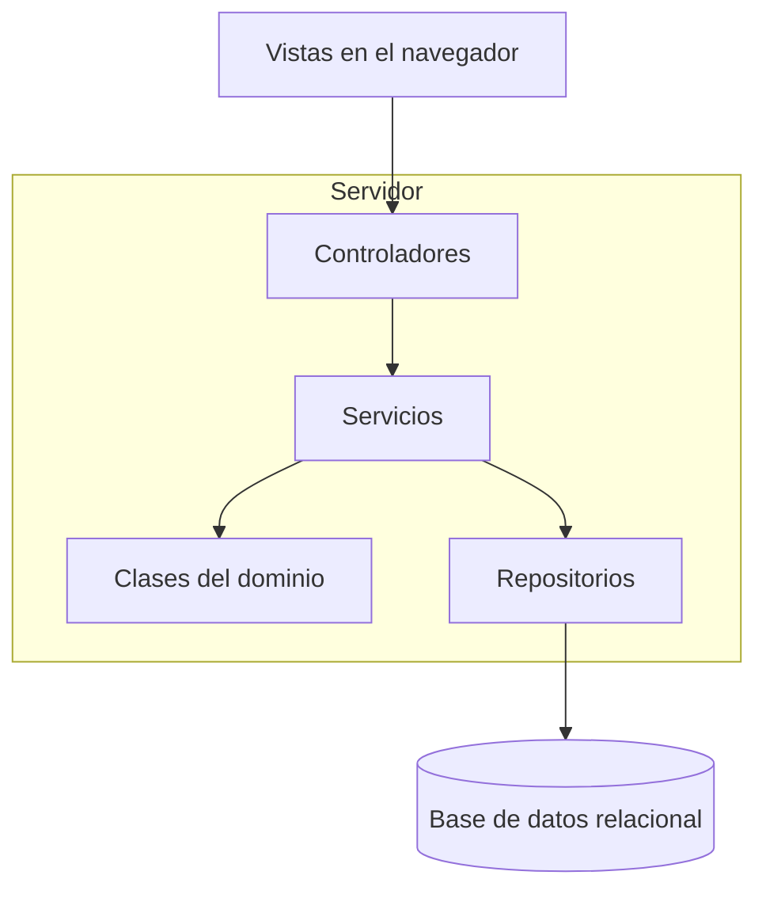

# Arquitectura del sistema

SIAR se organizará en capas: presentación, negocio y acceso a datos. Será una aplicación web con un servidor y una base de datos relacional. Esta es la propuesta de diseño; todavía no está implementada.

## Responsabilidades

| Parte | Responsabilidad |
| --- | --- |
| Vistas | Mostrar formularios, pedidos, mesas y reportes según el rol. |
| Controladores | Recibir solicitudes, comprobar los datos de entrada y devolver respuestas. |
| Servicios | Revisar permisos y coordinar las operaciones de cada módulo. |
| Clases del dominio | Representar usuarios, pedidos, reservas y demás entidades; aplicar sus reglas y cálculos. |
| Repositorios | Consultar y guardar datos. |
| Base de datos | Conservar la información, las relaciones y los valores únicos. |

## Organización

Las flechas indican quién usa a quién. Las vistas reciben las respuestas mediante los controladores y no acceden directamente a la base de datos.

## Funcionamiento

Los servicios se organizarán por usuarios, menú, mesas, pedidos, inventario, facturación, reservas y consultas. Reportes y dashboard usarán los datos existentes, sin guardar copias de cada resumen.

Por ejemplo, al pagar, el servicio de facturación verifica que el usuario sea cajero, que la factura no esté pagada y que el importe sea correcto. Después guarda el pago, cambia el pedido a Facturado y registra la operación. Estos cambios se confirman juntos; si alguno falla, se deshacen. La mesa se libera por separado.

## Reglas que debe cuidar el diseño

- Validar sesión y permisos en el servidor para cada operación.
- Proteger contraseñas con hash y no incluirlas en respuestas ni registros.
- Evitar pagos duplicados, reservas cruzadas y dos pedidos sin liberar en una mesa.
- Comprobar el estado vigente antes de guardar cambios simultáneos.
- Registrar entradas y salidas de inventario manualmente, sin permitir saldo negativo.

Se usarán transacciones y restricciones de la base de datos para conservar cambios completos y evitar duplicados. Las validaciones que consultan y actualizan disponibilidad deberán coordinarse dentro de la misma operación.

Las tecnologías, el alojamiento y los detalles de configuración se elegirán antes de programar. Las metas de rendimiento y disponibilidad se comprobarán con las pruebas previstas.

Este diseño desarrolla RNF07 y sigue los [requisitos](../02-ingenieria-de-requerimientos/03-requerimientos-funcionales.md), los [requisitos de calidad](../02-ingenieria-de-requerimientos/04-requerimientos-no-funcionales.md) y el [modelo de datos](../03-modelado/modelo_entidad_relacion.md).
