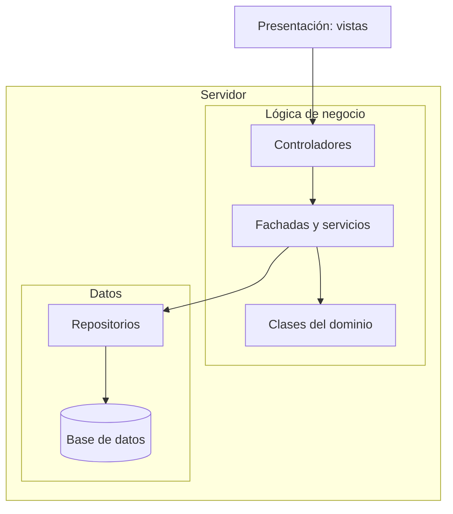

# Arquitectura del sistema

SIAR usará una arquitectura **cliente-servidor de tres capas**, como plantea el documento del proyecto. El personal accederá desde el navegador y el servidor procesará las operaciones.

| Capa | Qué hará | Componentes |
| --- | --- | --- |
| Presentación | Mostrar formularios, mesas, pedidos y reportes según el rol. | Vistas en el navegador. |
| Lógica de negocio | Validar datos y permisos; aplicar reglas y coordinar operaciones. | Controladores, fachadas, servicios y clases del dominio. |
| Datos | Consultar y guardar información, conservando sus relaciones. | Repositorios y base de datos relacional. |

## Organización

Las flechas muestran quién usa a quién. Las respuestas regresan a la presentación; el navegador no consulta directamente la base de datos.

## Aplicación de los patrones

- **Singleton:** una instancia de configuración general por proceso del servidor.
- **Facade:** un punto de entrada para coordinar pedidos o facturación.
- **Observer:** avisar de cambios confirmados para actualizar las vistas autorizadas.

Los servicios y repositorios organizan el trabajo dentro de las capas. Los patrones seleccionados para el proyecto son Singleton, Facade y Observer.

## Ejemplo: registrar un pago

El cajero confirma el pago. La fachada de facturación coordina la validación del rol, la factura y el importe. El servicio guarda el pago, el estado Facturado y su registro de auditoría en una transacción: se confirma todo o no se guarda nada. Después se notifica el cambio. Liberar la mesa es una operación aparte.

## Reglas principales

- Verificar sesión y permisos en el servidor; mantener cada sesión separada.
- Proteger contraseñas con hash y conservar el historial.
- Evitar pagos repetidos, reservas cruzadas y dos pedidos sin liberar en una mesa.
- Comprobar el estado vigente al recibir cambios simultáneos.
- Registrar el inventario manualmente, sin permitir saldo negativo.
- Generar reportes y dashboard mediante consultas a los datos existentes.

La propuesta cumple la separación pedida por RNF07. Las tecnologías y el mecanismo para enviar actualizaciones al navegador se elegirán antes de programar. El rendimiento y la disponibilidad se comprobarán con pruebas.

Ver [patrones](patrones-de-diseno.md), [requisitos](../02-ingenieria-de-requerimientos/03-requerimientos-funcionales.md) y [modelo de datos](../03-modelado/modelo_entidad_relacion.md).
